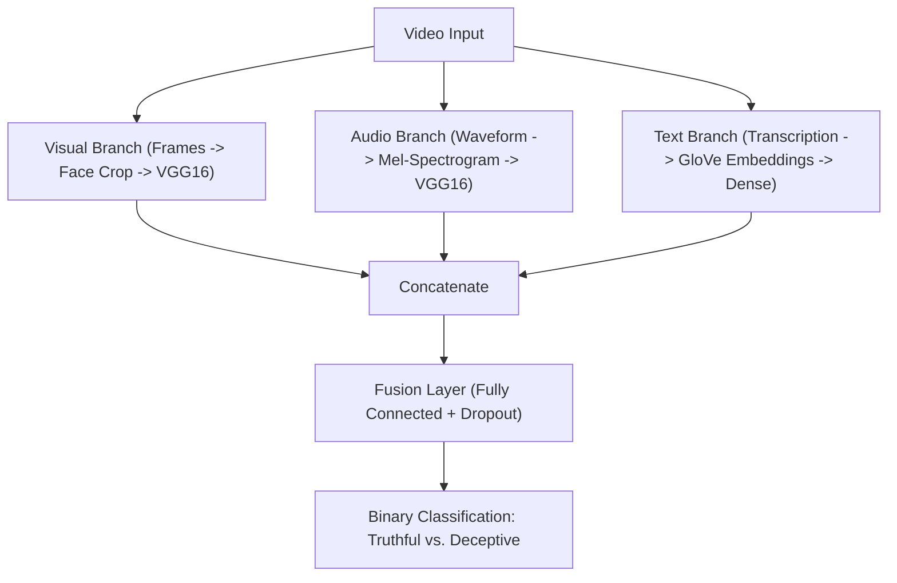

# Multimodal Deception Detection System


## Project Overview
This project implements a **Multimodal Lie Detector** designed to classify video clips as "Truthful" or "Deceptive." This model processes three  modalities independently before combining them for a final prediction:

1.  **Visual (Computer Vision):** Facial feature extraction using **VGG16** (Transfer Learning) on cropped face frames.
2.  **Audio (Signal Processing):** Prosodic analysis using Mel-Spectrograms processed by a secondary **VGG16** network.
3.  **Text (NLP):** Semantic analysis using **GloVe Embeddings** and Dense layers.

The system also leverage data cleaning through **Automated Anomaly Detection (Autoencoders)** and text mainpulation.

This system was developed to gain experience and improve my understanding in, Computer Vision, Signal Processing, Natrual Language Processing, and Nueral Networks.
---

## System Architecture

The pipeline follows a modular design pattern:


## Project Structure:
├── data/                      # Dataset directory
│   ├── Truthful/
│   └── Deceptive/
│
├── src/
│   │
│   ├── models/                # Neural Network Architectures
│   │   ├── frame_model.py             # VGG16 for Video Frames
│   │   ├── spectrogram_model.py       # VGG16 for Audio Spectrograms
│   │   ├── transcription_model.py     # NLP Model (GloVe + Dense)
│   │   ├── autoencoder_model.py       # Anomaly Detection Architecture
│   │   └── fusion_model.py            # Multimodal concatenation logic
│   │
│   ├── preprocessing/         # ETL Pipelines
│   │   ├── dataset_loader.py          # Data Processing and syncing 
│   │   ├── video_utils.py             # Frame Extraction and Face Cropping
│   │   ├── audio_utils.py             # Mel-Spectrogram generation
│   │   ├── text_utils.py              # OpenAI Whisper & Text Cleaning
│   │   └── anomaly_detector.py        # Autoencoder training & Anomaly filtering
│   │
│   ├── train.py               # Main (training) 
│   ├── predict.py             # Single Video Prediciton
│   ├── config.py              # Global configuration variables
│   └── utils.py               # Visualization & Helper functions
│
├── glove.6B.100d.txt          # Pre-trained Word Embeddings (External)
├── final_model.h5             # Trained Model
├── requirements.txt           # Project dependencies
└── README.md

### Prerequisires
* Python 3.9

## Installation
```
# Clone the repo
git clone [https://github.com/Gerardos0/Lie-Detector-Deep-Learning-Project.git](https://github.com/Gerardos0/Lie-Detector-Deep-Learning-Project.git)
cd Lie-Detector-Deep-Learning-Project

# Pull large model files
git lfs pull

# Install Python packages
pip install -r requirements.txt
```

## Dataset and Embeddings Setup
to run the training pipeline, you need to provide the training data and embeddings:

    Video Data:

        Place "Truthful" video clips (.mp4) into data/Truthful/.

        Place "Deceptive" video clips (.mp4) into data/Deceptive/.

    Word Embeddings:

        Download the GloVe 100d vectors (glove.6B.100d.txt) from the Stanford NLP Group.

        Place the .txt file in the root directory of the project.
## Running 
#### Training
```
python -m src.train
```
#### Predictions on Single Videos
```
python -m src.predict --video_path "path/to/my_video.mp4"
```
